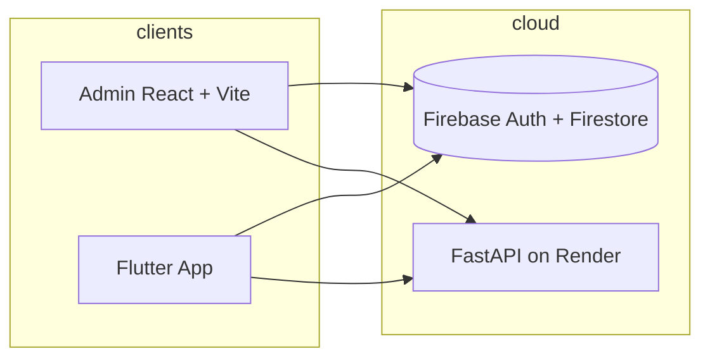

# Boon Hua Fishery

A dual-platform system for a Malaysian seafood retailer: a **web admin portal** for stock and sales, a **Flutter consumer app** for home inventory and meal ideas, and a **FastAPI backend** for recipe suggestions — synchronized through **Firebase (Firestore + Auth)**.

## Problem & solution

Small fisheries often track catch in **kilograms** and sell by **weight or ringgit total**, while customers struggle to remember what they bought and when it expires. Boon Hua Fishery digitizes:

| Stakeholder | Platform | Core workflows |
|-------------|----------|----------------|
| Shop owner / staff | Web admin (`boonhua_web`) | Log catch (kg + RM/kg), record sales, spoilage, PDF reports |
| Customer | Mobile app (`boon_hua_mobile`) | Virtual freezer, expiry reminders, receipt scan, meal ideas |
| System | API (`boonhua_backend`) | **AI** recipe suggestions & chat chef, TheMealDB/local fallback, optional inventory API |

## Architecture



- **Source of truth:** Firestore collections `inventory`, `orders`, `customers`, `inventoryHistory`, `storeSettings/main`, `app_config/public`.
- **Mobile API URL:** Loaded from `app_config/public.recipeApiBaseUrl` (set in admin Settings).
- **Deployed API:** [https://boon-hua-fishery.onrender.com](https://boon-hua-fishery.onrender.com)

### API health check (current production)

```json
GET https://boon-hua-fishery.onrender.com/

{
  "status": "Online",
  "firebase": true,
  "aiRecipes": true,
  "aiStatus": "/recipes/ai-status",
  "docs": "/docs"
}
```

| Field | How to enable |
|-------|----------------|
| `aiRecipes: true` | Render env `GEMINI_API_KEY` → redeploy |
| `firebase: true` | Render env `FIREBASE_CREDENTIALS_JSON` (service account JSON) → redeploy |

Details: `boon_hua_backend/DEPLOY_RENDER.md` sections 4–5.

## Repository layout

```
boon_hua_fishery/
├── boon_hua_backend/
├── boonhua_web/
├── boon_hua_mobile/
└── README.md
```

## Quick start

### Web admin

```bash
cd boonhua_web
npm install
npm run dev
```

### Backend

```bash
cd boon_hua_backend
pip install -r requirements.txt
uvicorn main:app --reload --port 8000
```

Save the API base URL in admin **Settings → Mobile Recipe API**:

`https://boon-hua-fishery.onrender.com`

Set **`GEMINI_API_KEY`** (or `OPENAI_API_KEY`) on the API server for AI recipes and the conversational chef (`/recipes/chat`). See `boon_hua_backend/DEPLOY_RENDER.md`.

### Mobile

```bash
cd boon_hua_mobile
flutter pub get
dart run flutter_native_splash:create
dart run flutter_launcher_icons
flutter run
```

## Demo flow

1. Admin: add catch → record sale → record spoilage → export report.
2. Mobile: register → add freezer item → open meal ideas.
3. Admin: verify customer list and API URL in Settings.

## Deployment

See `boon_hua_backend/DEPLOY_RENDER.md` and `GITHUB_SETUP.md`.
